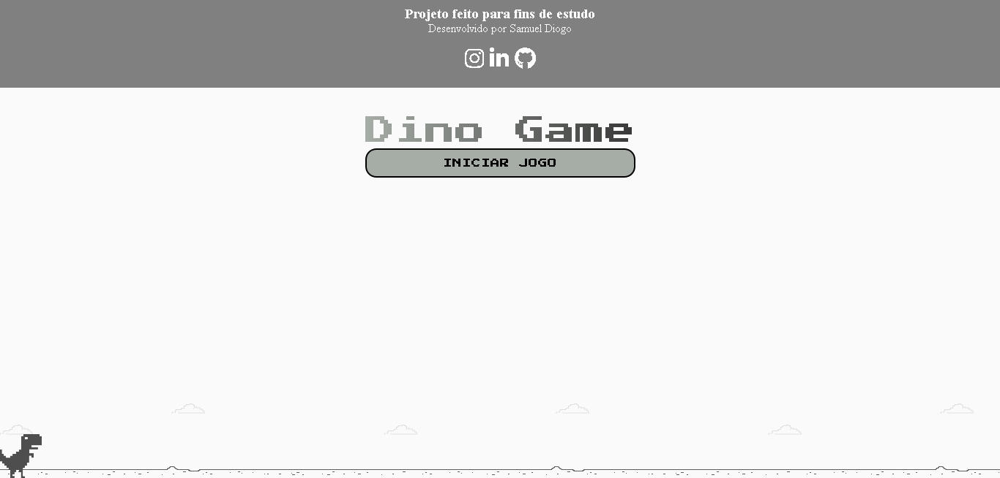

# projetoDio-jogo-dinossauro
Recriando o famoso jogo do dino sem internet. Projeto DIO

Neste projeto o desafio é criar uma cópia do jogo do dinossauro, famoso no Chrome por nos entreter quando estamos sem conexão. Nele iremos utilizar HTML, CSS e JavaScript, abordando de maneira simples diversos conceitos introdutórios importantes para programação na web como tags básicas de HTML, manipulação de eventos, funções e manipulação de elementos HTML usando JavaScript, estilização e animações básicas com CSS.

### RESOURCES

- HTML, CSS AND JAVASCRIPT.
- PNG Images;

### SLIDE

